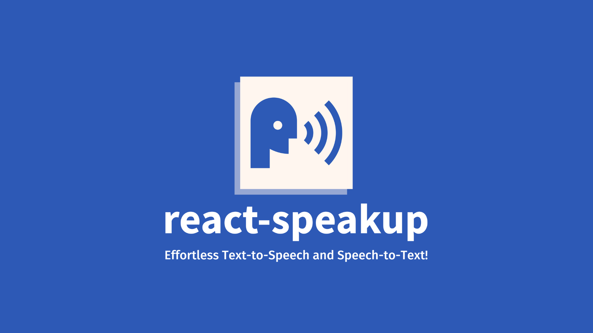

# Overview
React SpeakUp is a powerful React package designed to streamline voice interaction within your web applications. Leveraging the Web Speech API, it empowers developers to effortlessly integrate speech recognition and synthesis functionalities into React.js and Next.js projects.

### Key Features:

#### 1. **Voice to Text Conversion:**

-   Effortlessly convert spoken words into text with our intuitive `useVoiceToText` hook.
-   Speak with your native language and receive exact results.

#### 2. **Text to Voice Synthesis:**

-   Transform text content into spoken words using the versatile `useTextToVoice` hook.
-   Fine-tune voice characteristics such as pitch, rate, and volume for a personalized experience.

#### 3. **TypeScript Integration:**
-   Seamless integration with TypeScript ensures a robust development experience.

#### 4. **Easy Integration:**
-   Compatible with up to date versions of React.js and Next.js.

#### 5. **Styling Freedom:**

-   Unrestricted styling possibilities and no limitations on customization.


# Getting Started
Install via your favorite package manager

### Installation

    npm install react-speakup
or

    yarn add react-speakup


  ### Usage
  Convert voice to text with `useVoiceToText`

```jsx
import React from "react";
import { useVoiceToText } from "react-speakup";

const VoiceToTextComponent = () => {
  const { startListening, stopListening, transcript, reset } = useVoiceToText();

  return (
    <div>
      <button onClick={startListening}>Start Listening</button>
      <button onClick={stopListening}>Stop Listening</button>
      <button onClick={reset}>Reset Transcript</button>
      <span>{transcript}</span>
    </div>
  );
};

export default VoiceToTextComponent; 
```
`useVoiceToText` can take these options
| Properties | Description | Default Value |
|----------|----------|----------|
| lang |  the language you are speaking, e.g. "en-US" or "fa-IR" | "en-US" |
| continuous | if its true, it'll stop listening manually, otherwise it stop listening anytime the speech will finished | true |


Convert text to voice with `useTextToVoice`
```jsx
import React from "react";
import { useTextToVoice } from "react-speakup";

const TextToVoiceComponent = () => {
  const { speak, pause, resume, ref, setVoice, voices } = useTextToVoice<HTMLDivElement>();

  return (
    <div>
      <button onClick={speak}>Speak</button>
      <button onClick={pause}>Pause</button>
      <button onClick={resume}>Resume</button>
      <select
        onChange={(event: React.ChangeEvent<HTMLSelectElement>) =>
          setVoice(event.target.value)
        }
      >
        {voices.map((voice) => (
          <option key={voice}>{voice}</option>
        ))}
      </select>
      <div ref={ref}>
        <h1>It's not important which HTML tag your text is within.</h1>
        <div>
          Or <p>how many levels it is nested.</p>
        </div>
      </div>
    </div>
  );
};

export default TextToVoiceComponent;
```
`voices` are the list of voices you can use. you can set the voice using `setVoice` callback function.

`useTextToVoice` can take these options
| Properties | Description | Default Value |
|----------|----------|----------|
| pitch |  A float representing the utterance pitch value between 0 (lowest) and 2 (highest) | 1 |
| rate | A float representing the utterance rate value. It can range between 0.1 (lowest) and 10 (highest) | 1 |
| volume | A float that represents the volume value, between 0 (lowest) and 1 (highest) | 1 |

# Contributing
Contributions are very welcome and wanted.

## Keywords
web-speech-api, react-speakup, speech-recognition, speech-synthesis, voice-to-text, text-to-voice, speak